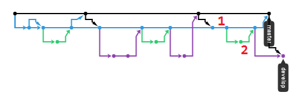

# GIT-FLOW-TEST

### GIT FLOW 개념도


### 시작하기
```bash
$ git flow init
```

### 주요 브랜치 설명
 - master
 - develop
 - feature/bugfix
 - hotfix

### GIT Branch bash에서 시각화
`A DOG!`
```bash
$ git log --All --Decorate --Oneline --Graph
```

### --no-ff 옵션

 - **1번: --no-ff 옵션을 사용하지 않음.**
   - feature 브랜치가 develop 브랜치의 커밋으로 통일됨.
 - **2번: --no-ff 옵션을 사용함.**
   - feature 브랜치가 별도로 존재함.

## release 후에 git push
 - **Before:** develop 브랜치만 push한 경우.
 - **After:** develop 브랜치 push 후 master bransh push
 
 
 
 - master 브랜치 push 전에는 5번 커밋이 마스터로 머지된 커밋이라는 것을 인식하지 못하는 것 같다.
 - master 브랜치에서 push하면 문제가 해결된다.
 

### 래퍼런스
 - [git-flow cheatsheet](http://danielkummer.github.io/git-flow-cheatsheet/index.ko_KR.html)
 - [[GIT]git-flow 사용하기](https://uroa.tistory.com/106)
 - [[Review] gitflow, 쉬운 git branch 관리](http://huns.me/development/1131)