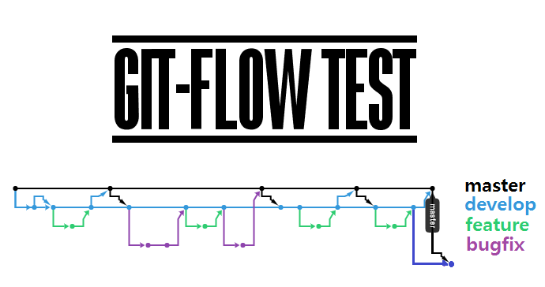

<p align="center">
    
</p>

<p align="center">
	<a href="https://img.shields.io/github/v/release/dokysp-study/git-flow-test" alt="GitHub release (latest by date)">
		
	</a>
	<a href="https://img.shields.io/github/release-date/DokySp-study/git-flow-test" alt="GitHub Release Date">
		
	</a>
	<a href="https://img.shields.io/github/last-commit/dokysp-study/git-flow-test/develop?label=last%20commit%20%28develop%29&logo=git&logoColor=white" alt="GitHub last commit (branch)">
		
	</a>
	<a href="https://img.shields.io/github/license/dokysp-study/git-flow-test" alt="GitHub License">
		
	</a>
</p>

### GIT FLOW 개념도

<p align="center">
	
</p>

### 시작하기
```bash
$ git flow init
```

### 주요 브랜치
 - **master**
   - 배포 시 사용하는 브랜치
   
 - **develop**
   - 개발 단계에서 사용하는 브랜치
   
 - **feature/bugfix**
   - 새로운 기능/버그 수정시 사용하는 브랜치
   ```bash
   $ git flow feature start [기능 이름]
   ...
   # 기능 개발/추가 커밋들
   ...
   $ git flow feature finish [기능 이름]
   ```
   - feature 또는 bugfix를 finish할 경우
     - feature -> develop 병합
   - 다른 개발자와 feature 내용을 공유하기 위해 원격 저장소에 push 할 때
   ```bash
   $ git flow feature publish
   ```
   
 - **release**
   - develop에서 최종 배포(master) 시 사용하는 브랜치
   ```bash
   $ git flow release start [릴리즈 버전(ex> v#.0.0)]
   ...
   # 최종 배포버전을 위한 버그 수정 커밋들
   ...
   $ git flow release finish [릴리즈 버전]
   ```
   - release를 finish할 경우
     - release -> develop 병합
	 - release -> master 병합
   - release finish한 이후에 develop 브랜치와 master 브랜치 각각 `$ git push`를 해주어야 한다. ([설명](#release-후에-git-push))
   
 - **hotfix**
   - 배포 중인 서비스를 긴급하게 수정할 때 사용하는 브랜치
   ```bash
   $ git flow hotfix start [핫픽스 버전(ex> v1.0.#)]
   ...
   # 최종 배포버전을 위한 버그 수정 커밋들
   ...
   $ git flow hotfix finish [핫픽스 버전]
   ```
   - hotfix finish할 경우
     - hotfix -> develop 병합
	 - hotfix -> master 병합
   - ~~hotfix finish한 이후에 develop 브랜치와 master 브랜치 각각 `$ git push`를 해주어야 한다. ([설명](#release-후에-git-push))~~ 확인 필요
   
 - **~~support~~** (베타기능)
 
<br>

## 참고

### --no-ff 옵션


## release 후에 git push
 - **Before:** develop 브랜치만 push한 경우.
 - **After:** develop 브랜치 push 후 master bransh push
 
 
 
 - master 브랜치 push 전에는 5번 커밋이 마스터로 머지된 커밋이라는 것을 인식하지 못하는 것 같다.
 - master 브랜치에서 push하면 문제가 해결된다.
 
### GIT Branch bash에서 시각화
`A DOG!`
```bash
$ git log --All --Decorate --Oneline --Graph
```


### 래퍼런스
 - [git-flow cheatsheet](http://danielkummer.github.io/git-flow-cheatsheet/index.ko_KR.html)
 - [[GIT]git-flow 사용하기](https://uroa.tistory.com/106)
 - [[Review] gitflow, 쉬운 git branch 관리](http://huns.me/development/1131)
 - [[GitHub] Git 브랜치의 종류 및 사용법 (5가지)](https://gmlwjd9405.github.io/2018/05/11/types-of-git-branch.html)
